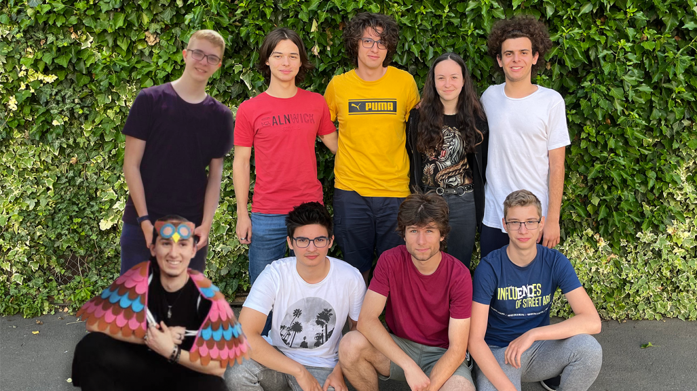
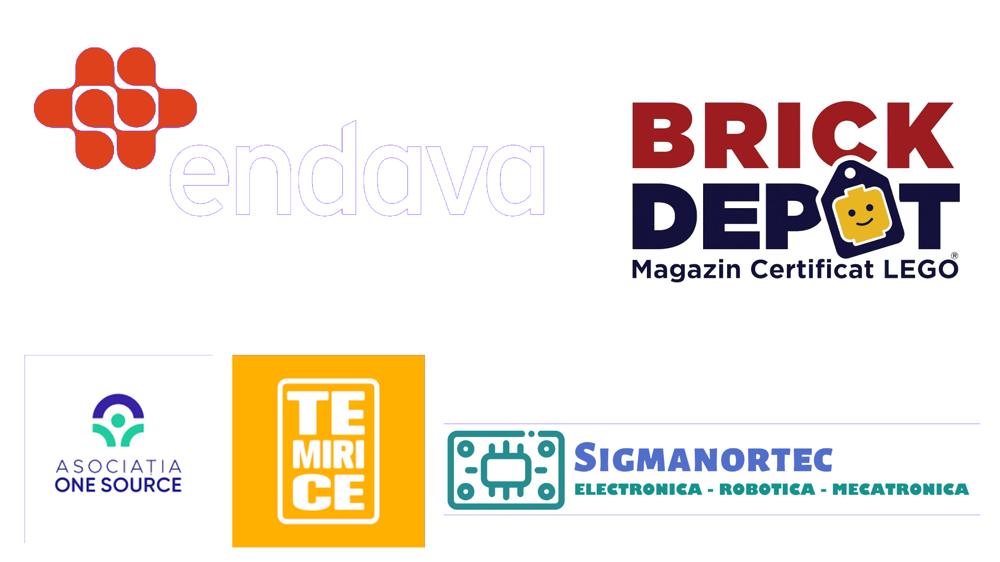
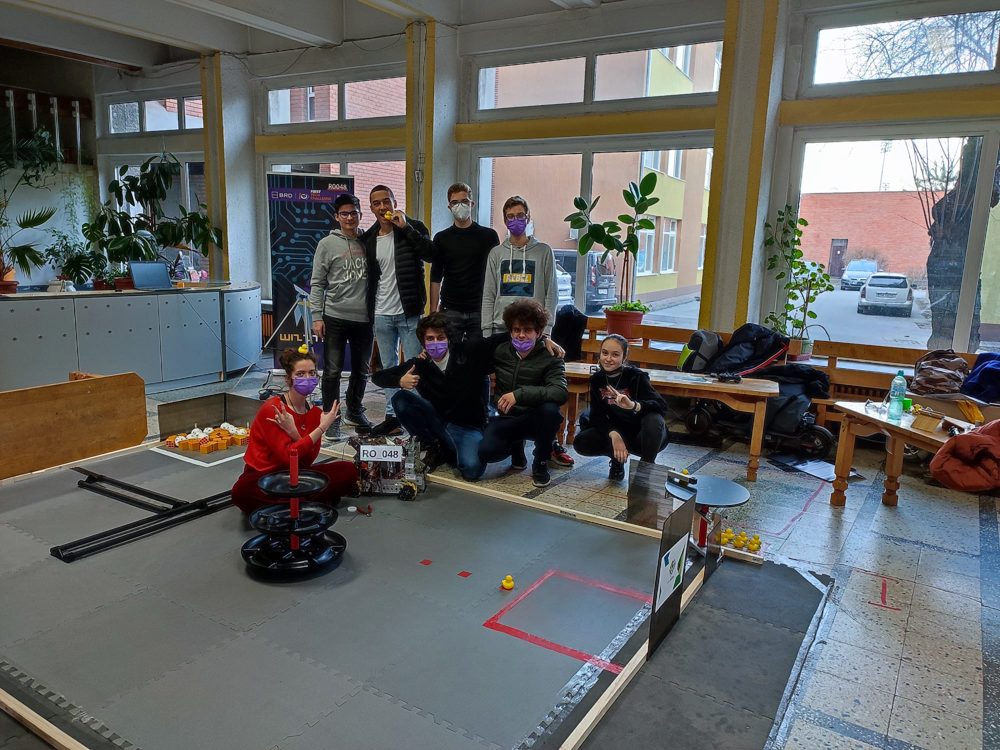

# WizzTech 2021-2022 - Freight Frenzy

This code was developed during the 2021-2022 FIRST Tech Challenge Freight Frenzy by the 19094 WizzTech Robotics team.

You can take a look at ours team notebook for this season right here: [WizzTech's Team Notebook](https://drive.google.com/file/d/1prgW-KJX31VKSASJfa112QSmGd3WIRzn/view?usp=sharing)

## Programming

The code was written in Java.

Members of the programming field :
- Teo Maxim (see Teo's [GitHub profile](https://github.com/tmaxmax))
- Vlad Tomici (see Vlad's [GitHub profile](https://github.com/VladTomici14))
- Pavel Prodan (see Pavel's [GitHub profile](https://github.com/PavelProdan))
- Mihai Albu (see the Mihai's [GitHub profile](https://github.com/LittleGreenMen-1))

## Autonomous
We have used a state machine for giving robot instructions during the autonomous period. 

The movement of the robot was based on instructions and on the IMU sensor from the REV Control Hub.

## Special thanks

We would like to thank everyone who was a part of our journey during the 2021-2022 season. 

Many thanks to our sponsors ! We are always grateful for having such amazing people by our side ! 

 Created with love and passion 💜 
  

 Timisoara, Romania 
  

 sept 2021 - aug2022 
  
